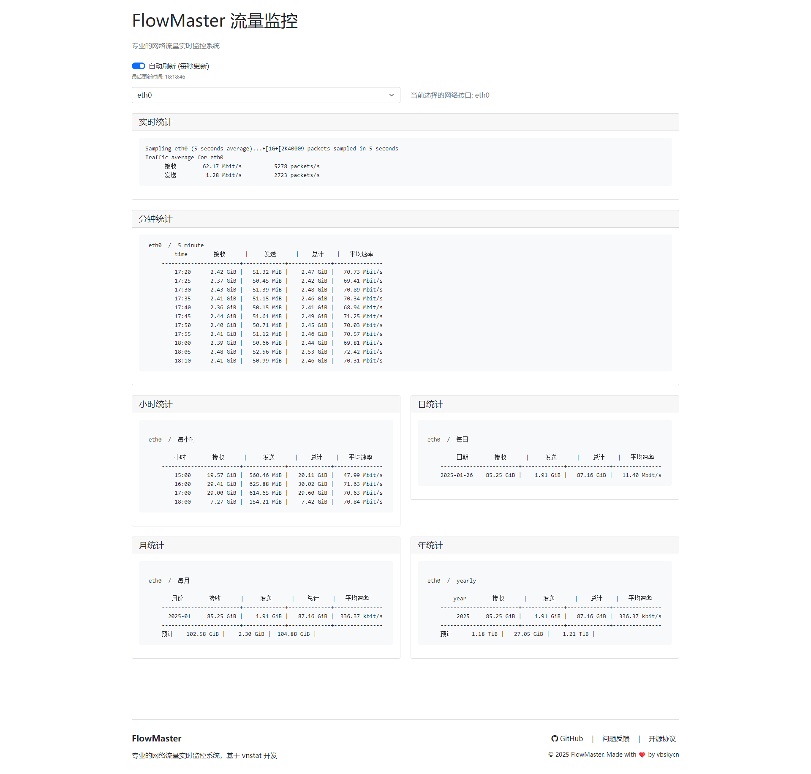

# FlowMaster - 专业的网络流量监控系统

[](https://github.com/vbskycn/FlowMaster/blob/main/LICENSE)[](https://github.com/vbskycn/FlowMaster/stargazers)[](https://github.com/vbskycn/FlowMaster/issues)



## 📝 项目介绍

FlowMaster 是一个基于 vnstat 的专业网络流量监控系统，提供实时流量统计、历史数据分析等功能。系统采用现代化的 Web 界面，支持多网卡监控，让网络流量监控变得简单而强大。

### ✨ 主要特性

- 🚀 实时流量监控
- 📊 多维度数据统计（分钟、小时、日、月、年）
- 🌐 多网卡支持
- 🎯 自动刷新功能
- 📱 响应式设计，支持移动端
- 🌙 现代深色主题
- 🔄 数据自动更新

## 🛠️ 技术栈

| 组件 | 技术 |
|-----------|------------|
| 后端框架 | Node.js + Express |
| 前端框架 | Vue 3 + Bootstrap 5 |
| 监控工具 | vnstat |
| 接口类型 | RESTful API |

## 📦 安装部署

### 环境要求

| 组件 | 版本 |
|-----------|---------|
| Node.js | 14.0.0 或更高版本 |
| vnstat | 2.0.0 或更高版本 |
| 包管理器 | npm 或 yarn |

### 一键部署

```bash
curl -fsSL https://raw.githubusercontent.com/vbskycn/FlowMaster/main/install.sh | sudo bash
```

### 常用命令

启动服务:
```bash
flowmaster start
```

停止服务:
```bash
flowmaster stop
```

重启服务:
```bash
flowmaster restart
```

查看状态:
```bash
flowmaster status
```

卸载服务:
```bash
flowmaster uninstall
```

### 访问方式

安装完成后，通过浏览器访问：`http://服务器IP:10088`

> 注意：请确保防火墙已放行 10088 端口

### 手动安装步骤

#### 1. 安装 vnstat

```bash
# Debian/Ubuntu
sudo apt-get install vnstat

# CentOS
sudo yum install vnstat
```

#### 2. 安装 PM2
```bash
# 全局安装 PM2
sudo npm install -g pm2

# 设置 PM2 开机自启
sudo pm2 startup
```

#### 3. 克隆项目

```bash
git clone https://github.com/vbskycn/FlowMaster.git
cd FlowMaster
```

#### 4. 安装依赖

```bash
npm install
# 或
yarn install
```

#### 5. 使用 PM2 启动服务

```bash
# 启动服务
pm2 start server.js --name flowmaster

# 保存 PM2 配置
pm2 save
```

#### 6. PM2 管理命令

```bash
# 查看服务状态
pm2 status flowmaster

# 查看服务日志
pm2 logs flowmaster

# 重启服务
pm2 restart flowmaster

# 停止服务
pm2 stop flowmaster

# 删除服务
pm2 delete flowmaster

# 查看详细信息
pm2 show flowmaster

# 监控服务
pm2 monit
```

默认访问地址：`http://localhost:10088`

### 🔧 配置说明

使用 PM2 设置环境变量：

```bash
# 设置端口
pm2 start server.js --name flowmaster --env PORT=8080

# 或在 ecosystem.config.js 中配置
echo 'module.exports = {
  apps: [{
    name: "flowmaster",
    script: "server.js",
    env: {
      PORT: 8080
    }
  }]
}' > ecosystem.config.js

# 使用配置文件启动
pm2 start ecosystem.config.js
```

## 📖 使用说明

1. 系统启动后，自动检测可用网卡
2. 在界面上选择要监控的网卡
3. 查看实时流量和历史统计数据
4. 可开启自动刷新功能，实时更新数据

## 🤝 贡献指南

欢迎提交 Issue 和 Pull Request！

1. Fork 本项目
2. 创建新分支：`git checkout -b feature/AmazingFeature`
3. 提交更改：`git commit -m 'Add some AmazingFeature'`
4. 推送分支：`git push origin feature/AmazingFeature`
5. 提交 Pull Request

## 📄 开源协议

本项目采用 MIT 协议开源，详见 [LICENSE](LICENSE) 文件。

## 👨‍💻 作者

**vbskycn**

- GitHub: [@vbskycn](https://github.com/vbskycn)

## 🙏 致谢

- [vnstat](https://github.com/vergoh/vnstat) - 强大的网络流量监控工具
- [Vue.js](https://vuejs.org/) - 渐进式 JavaScript 框架
- [Bootstrap](https://getbootstrap.com/) - 流行的前端组件库

## 📞 联系方式

如有问题或建议，欢迎通过以下方式联系：

- 提交 [Issue](https://github.com/vbskycn/FlowMaster/issues)
- 访问我的 [GitHub 主页](https://github.com/vbskycn)

---

如果这个项目对你有帮助，欢迎 star ⭐️


